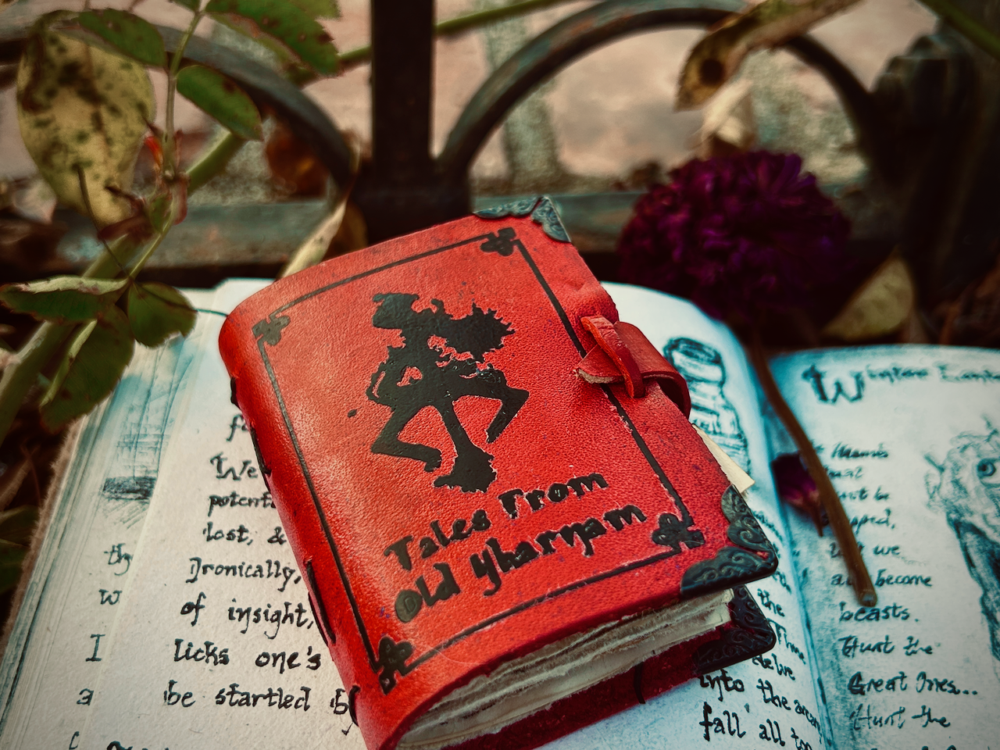

## Mini Books

*"A tiny book, fitting right into the palm of your hand. Notes scrawled on the tea-stained pages describe many worlds and peoples, with illustrations to brighten however you choose to add to them."*

---

## Stats
- 2"x3" inches
- A8 Paper Size designed to fit in the palm of your hand
- About 90-120 pages total
- Tea-stained paper
- Illustrations and text to decorate pages

---

## Notes
- Each book is handcrafted, making every copy unique.
- Features illustrations to make it feel like you're traversing the Lands Between or out and about in Anor Londo
- Pages are in random order, but guaranteed to have content

---

## Acquisition
- [Etsy Shop Listing](https://www.etsy.com/listing/1673521600/handbound-mini-soulsborne-grimoire-basic)
- **[Bloodborne](https://technomancer01.etsy.com/listing/1794521603/mini-bloodborne-grimoire-handbound)** Shop Link
- **[Elden Ring](https://technomancer01.etsy.com/listing/1780325542/mini-elden-ring-grimoire-handbound)** Shop Link

---

## Gallery

